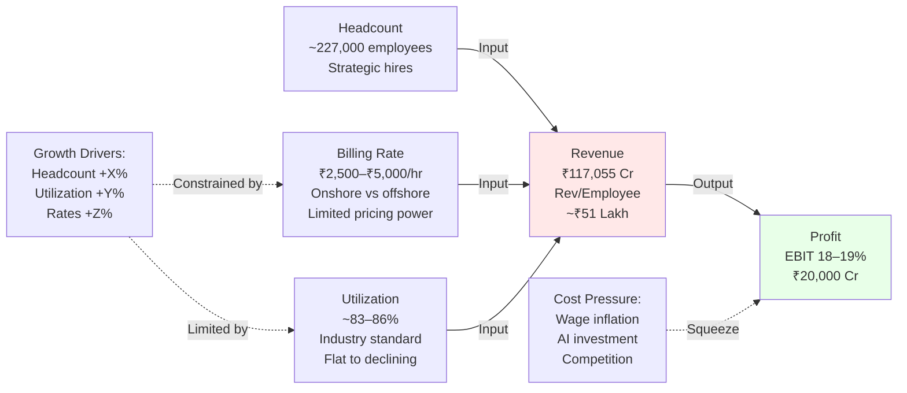
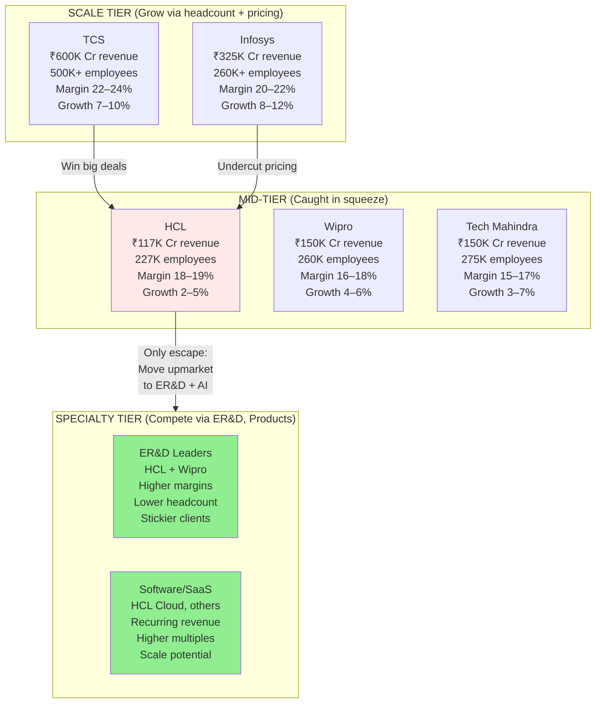
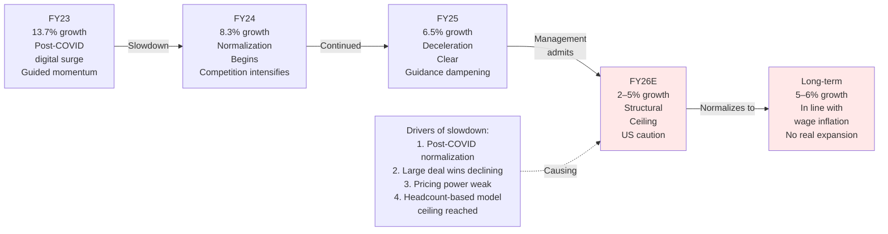
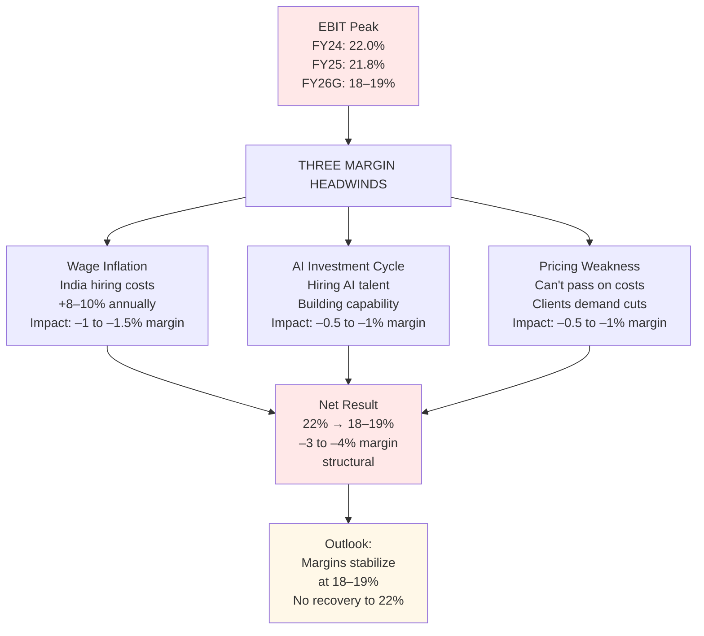
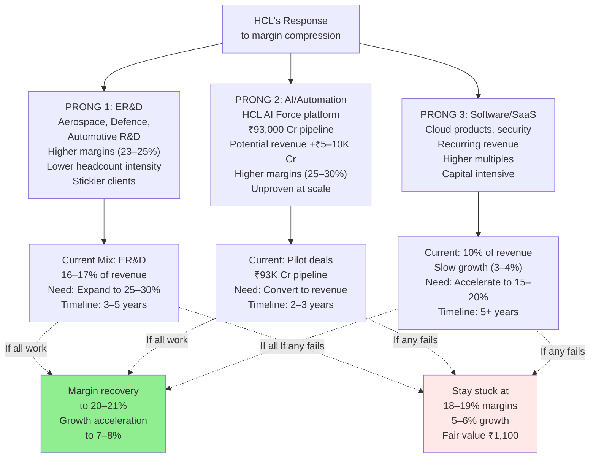
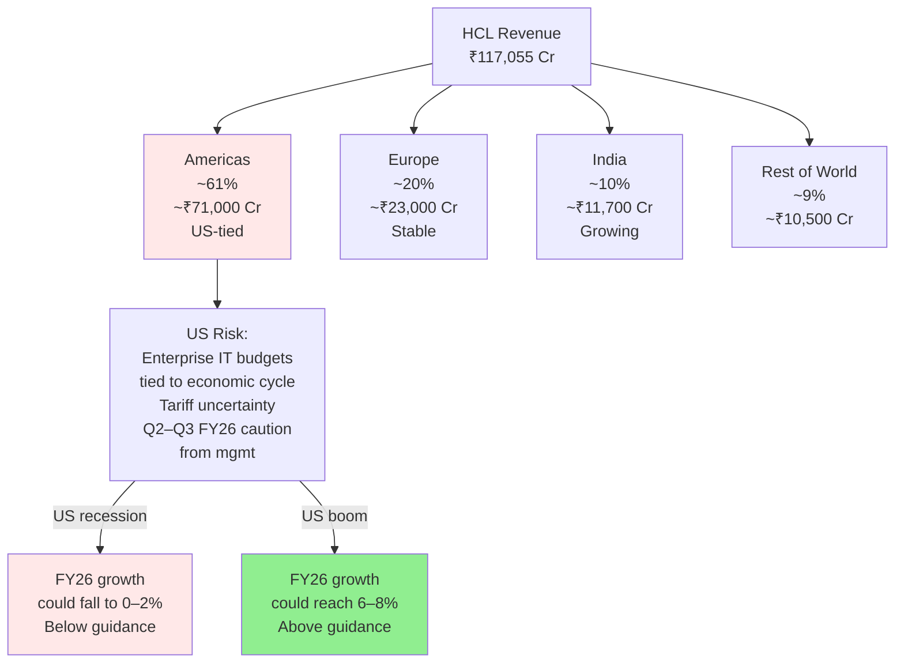
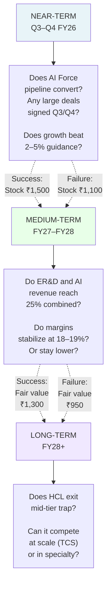
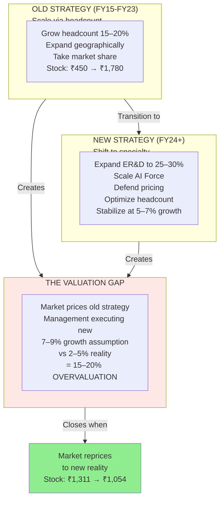

# STRATEGY DECK

**Read Time:** 8 minutes  
**Key Takeaway:** HCL is caught between scale giants and specialty players. Its strategy is to diversify (AI, ER&D, products) while defending its core IT services base.  
**Who Should Read This:** Strategists understanding competitive positioning, founders learning about mid-tier compression

---

## The Strategic Narrative

HCL's strategy is shifting, and it has to.

For a decade (FY15–FY23), the play was **"grow headcount, expand geographically, take market share."** HCL scaled from ₹20,000 Cr to ₹100,000+ Cr. Stock ran from ₹450 to ₹1,780. Everyone was happy.

That phase is ending.

The new phase: **"Defend margins, shift to ER&D and AI, optimize headcount, stabilize pricing."** This is the strategy of a maturing business. Not exciting. But necessary. The problem: The market still prices HCL for the old strategy (7–9% growth). Management is executing the new strategy (2–5% growth). The disconnect is 15–20% of the stock price.

---

## HCL's Unit Economics (The Revenue Engine)

**The core insight:** HCL doesn't control pricing or utilization anymore. It can only control headcount. But headcount growth requires hiring at rising wages. This is the margin squeeze trap.

---

## Competitive Market Structure (Where HCL Sits)

**The strategic tension:** HCL is too large to be nimble (like smaller ER&D players), not large enough to dominate (like TCS). It's stuck in the middle—exactly where margin compression happens.

---

## Growth Deceleration (The Slowdown Story)

**Translation:** Growth didn't just decline—it hit a structural ceiling. 2–5% is not a cyclical dip. It's the new normal.

---

## Margin Pressure Drivers (Why EBIT Is Falling)

**Why it matters:** If margins were just cyclical, they'd recover in a boom. But they're structural. That's permanent, not temporary.

---

## Strategic Response: Three-Pronged Pivot

**The strategic bet:** HCL is betting it can shift revenue mix away from commoditized IT services toward higher-margin ER&D and AI. If this works, fair value is ₹1,300–1,500. If not, fair value stays ₹1,100–1,200.

---

## US Dependency (The Macro Risk)

**Translation:** 61% of HCL's revenue depends on US enterprise spending. A US recession is HCL's biggest risk.

---

## Strategic Inflection Points (What to Watch)

**Translation:** HCL's valuation is a bet on whether near-term execution (AI conversion) succeeds. If both quarters show momentum, stock re-rates. If neither materializes, stock stays depressed.

---

## Strategic Summary (The Complete Picture)

**The complete strategic story:** HCL is transitioning successfully from a scale-based model to a specialty-based model. The market hasn't priced this transition yet. That's the opportunity—and the risk.

