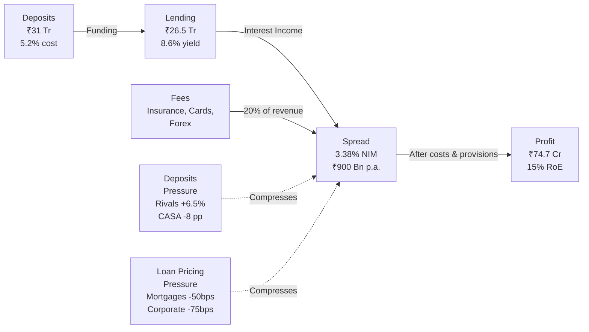
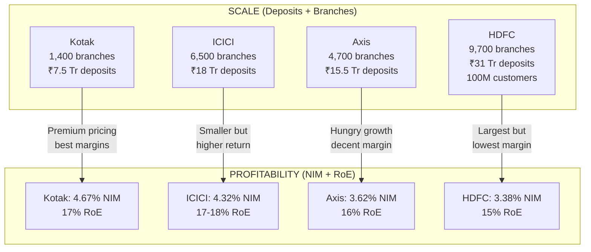
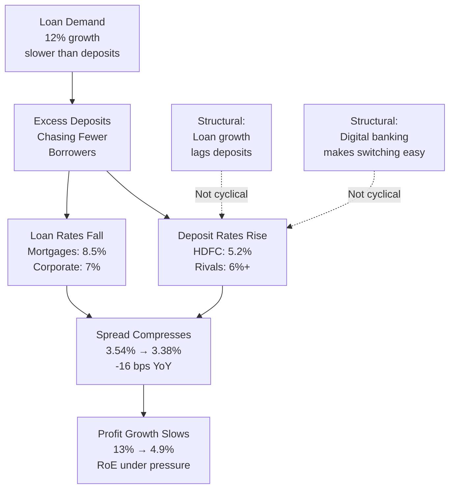
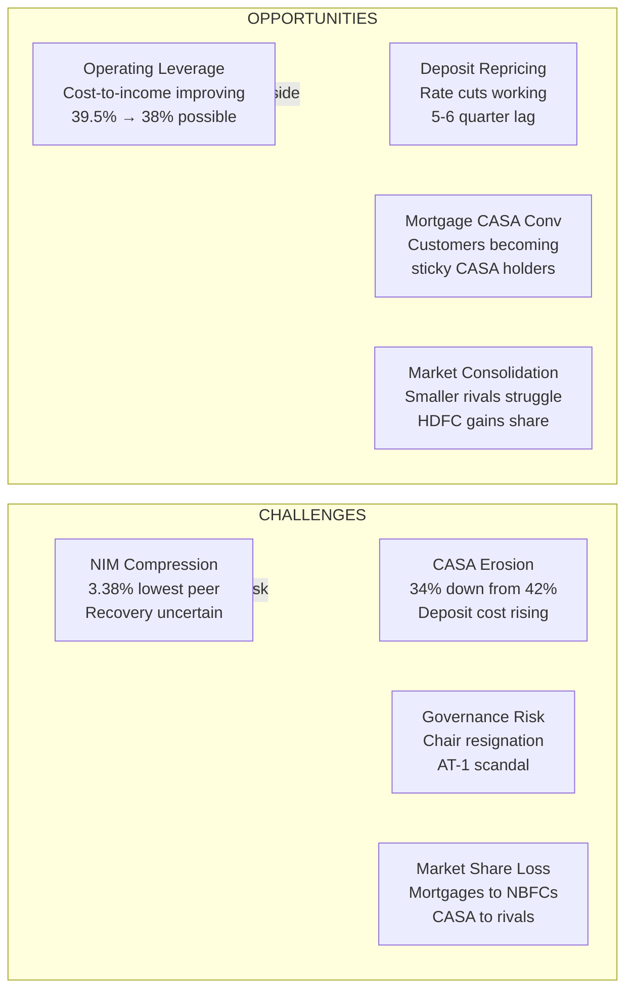
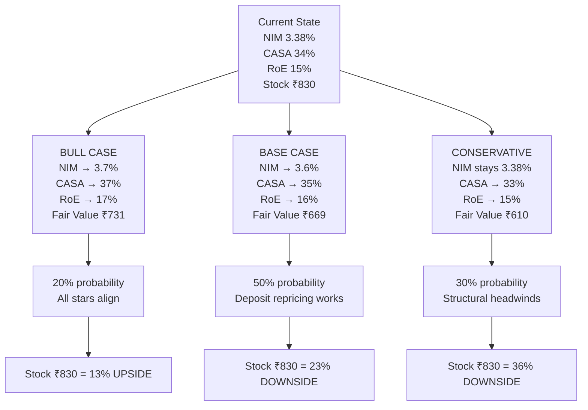
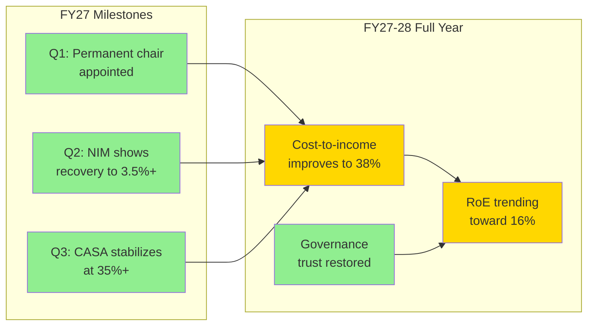
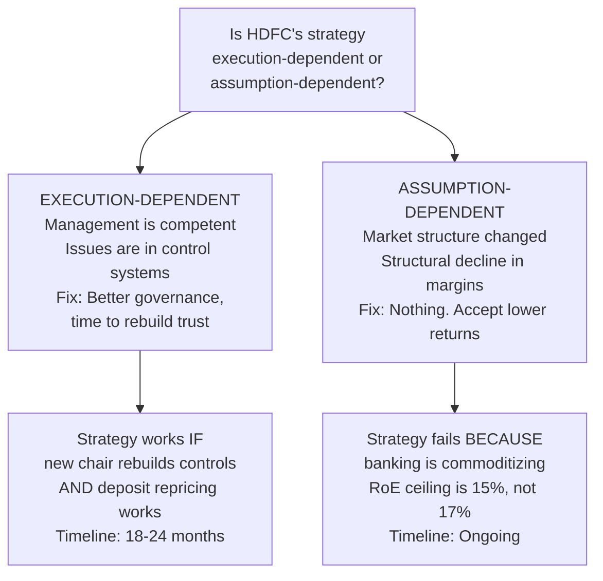
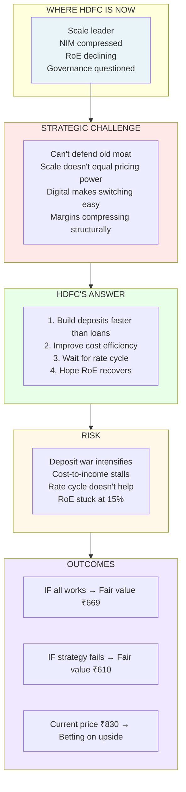

# STRATEGY DECK

**Read Time:** 8 minutes 
**Key Takeaway:** HDFC's strategy is clear but constrained. Grow deposits + improve efficiency + recover margins. Execution is the only unknown.  
**Who Should Read This:** Strategists understanding competitive positioning, founders learning from sector dynamics

---

## The Strategic Narrative

HDFC's strategy for the next 3 years: **Grow the balance sheet while defending margins.**

For 20 years, this was easy. HDFC was so large and trusted that it could grow 15%+ while maintaining spreads. Today, it's hard. Competitors have caught up operationally. Customers compare rates on their phones. Margins compress when you grow.

HDFC's move: Build deposits faster than loans (14.4% vs. 12%) to create liquidity buffer. Improve cost efficiency (39.5% cost-to-income) to offset margin pressure. Wait for rate cycle to ease deposit competition. Hope RoE recovers to 16%+ by FY27–28.

It's a **patience strategy**, not an aggression strategy. In a competitive market, that's risky.

---

## HDFC's Business Model (How Money Flows)

**The core insight:** Spread (3.38%) is the engine. When it compresses (red dotted lines), everything slows.

---

## Competitive Positioning Map

**The strategic tension:** HDFC has scale (winning position on left). But Kotak and ICICI are winning on profitability (right). HDFC is stuck in the middle.

---

## The Margin Compression Problem (Why It's Happening)

**Why it matters:** This isn't fixed by one rate cycle. It's structural until loan demand accelerates.

---

## Strategic Challenges vs. Opportunities

**The strategic bet:** Opportunities outweigh challenges IF execution is flawless.

---

## HDFC's Forward Path (Three Scenarios)

**The asymmetry:** Downside risk (23–36%) is larger than upside (13%).

---

## What HDFC Must Execute (The Strategic Checklist)

**Green = Leadership signals | Gold = Financial recovery | No execution = thesis broken**

---

## Strategic Question (The Core Uncertainty)

**Our belief:** 65% execution-dependent, 35% assumption-dependent. That's why conviction is medium, not high.

---

## Strategic Summary (One Diagram)

