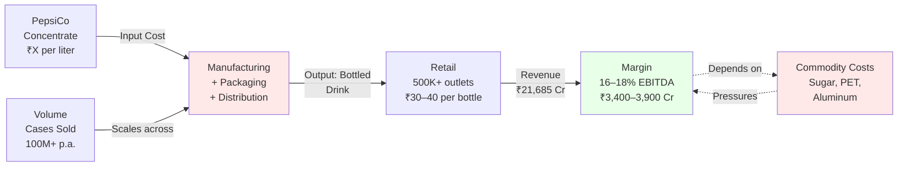
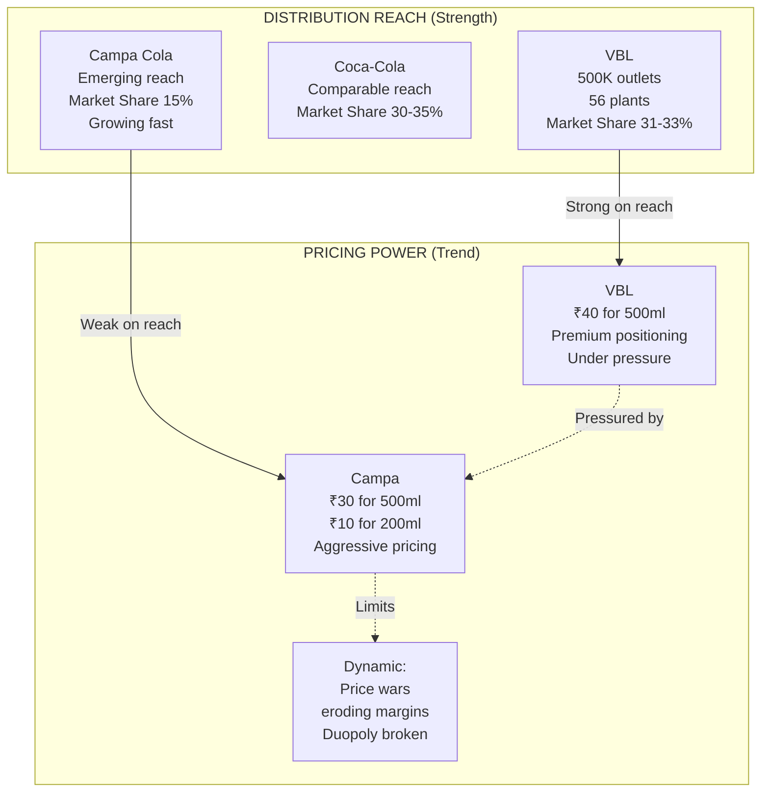
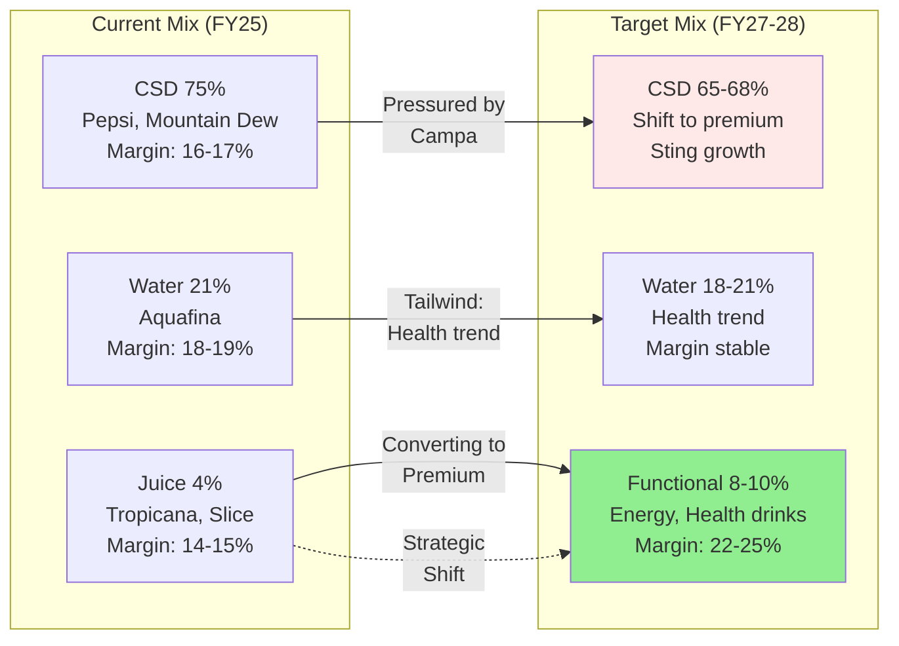
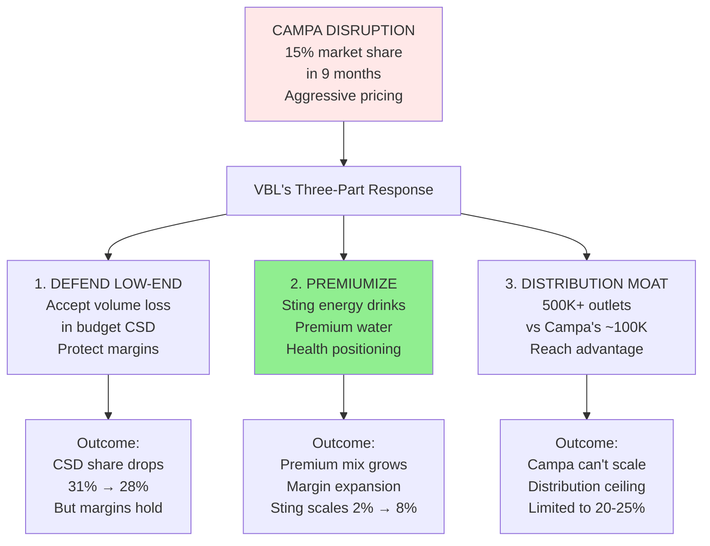
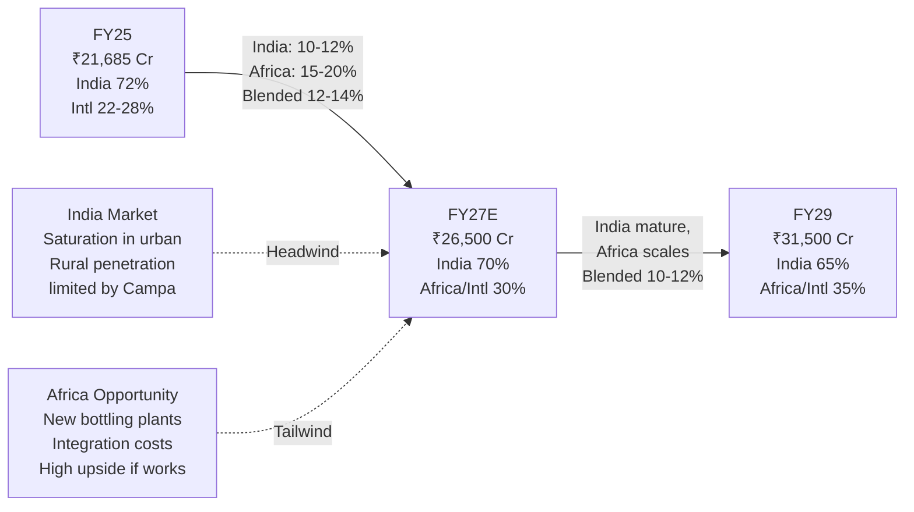
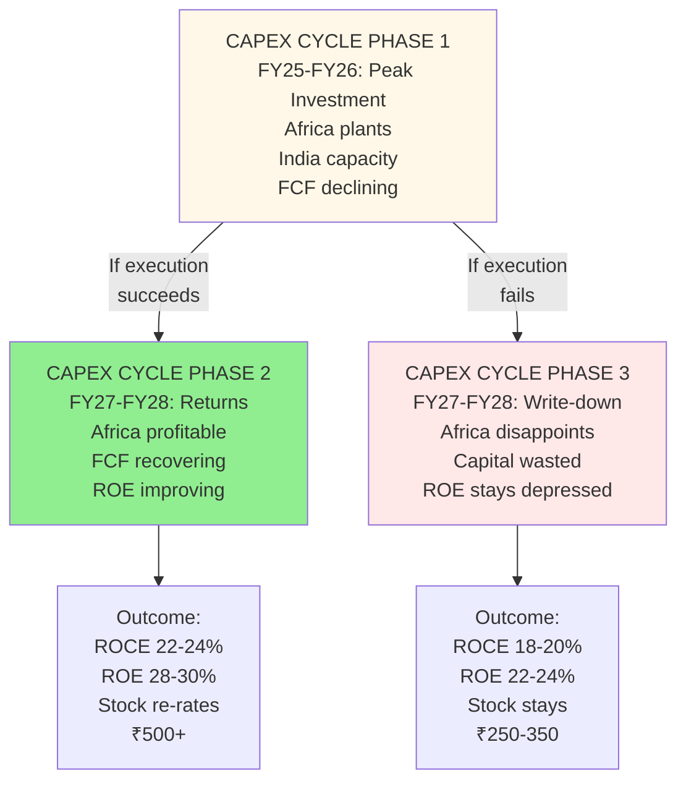
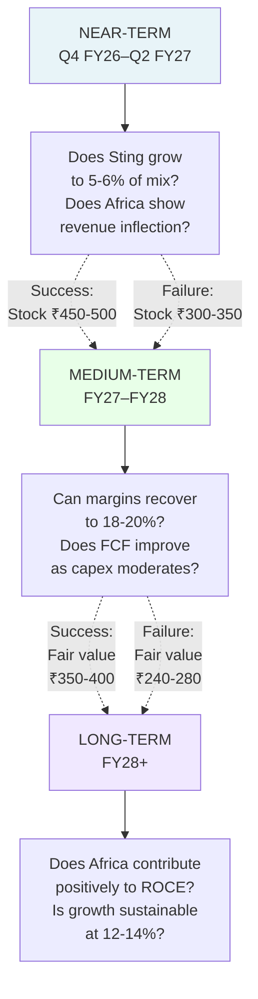

# STRATEGY DECK

**Read Time:** 8 minutes  
**Key Takeaway:** VBL is pivoting from growth-at-all-costs to profitable compounding. The strategy is sound, but execution is unproven.  
**Who Should Read This:** Strategists understanding competitive positioning, founders learning portfolio transitions

---

## The Strategic Narrative

VBL's strategy is shifting. For five years (FY21–FY25), the play was **"grow volume, build scale, expand territory."** The company grew from ₹8,000 Cr to ₹21,685 Cr. Africa acquisition added new markets. Stock ran from ₹200 to ₹568. Everyone was happy.

That phase is over.

The new phase: **"Defend margin, premiumize product, stabilize growth, prove Africa."** This is the strategy of a maturing business. Not exciting. But necessary.

The risk: The market still prices VBL for the old strategy (18–20% growth). Management just announced the new strategy (10–13% growth). The disconnect is 40% of the stock price.

---

## VBL's Business Model (The Spread Game)



**The core insight:** VBL doesn't own the brands. It owns the **distribution and manufacturing efficiency**. That's the moat. That's also the constraint—PepsiCo controls pricing, VBL controls cost.

---

## Competitive Positioning: Market Share vs. Pricing Power



**The strategic tension:** VBL has distribution scale that Campa can't match. But Campa has price aggression that VBL won't match. Result: Price wars in low-end CSD (Mirinda, 7UP), but VBL's premium products (Sting, Aquafina, Tropicana) remain defensible.

---

## Product Mix Evolution (The Pivot to Premium)



**Why this matters:** If Sting (energy drinks) scales from 2% to 8% of revenue, blended EBITDA margins could recover to 18–20% despite CSD pricing pressure. This is THE strategic bet.

---

## The Campa Threat & VBL's Response



**The strategic insight:** VBL isn't fighting Campa on price. It's abandoning the low-end and moving upmarket. This is rational. It's also risky—if Sting doesn't scale, margins compress without relief.

---

## Revenue Growth Path (India + Africa Split)



**What to watch:** If Africa revenue inflects positive in FY26 (currently diluting margins), the growth story re-rates. If it stays a drag into FY27, it's a capital allocation miss.

---

## Capex Cycle & Capital Returns



**The core uncertainty:** Is this capex cycle (heavy investment in Africa/new plants) a value-creator or value-destroyer? Management says value-creator. History says they execute. But Africa is the unknown.

---

## Strategic Inflection Points (What to Watch)



**Translation:** VBL's valuation is a bet on whether near-term execution (Sting + Africa) succeeds. If both deliver, fair value moves to ₹350–400. If either fails, fair value stays ₹240–280.

---

## Strategic Summary (The Big Picture)

```mermaid
graph TB
    subgraph Old["OLD STRATEGY (FY21-FY25)<br/>Hyper-growth phase"]
        O1["Grow volume 25-40%<br/>Expand territory aggressively<br/>Build Africa platform<br/>Stock: ₹200 → ₹568"]
    end
    
    subgraph New["NEW STRATEGY (FY26+)<br/>Maturation phase"]
        N1["Grow volume 10-13%<br/>Defend profitability<br/>Premiumize product mix<br/>Prove Africa ROI"]
    end
    
    subgraph Gap["THE VALUATION GAP"]
        Gap["Market prices old strategy<br/>Management executing new<br/>18-20% growth assumption<br/>vs 10-13% reality<br/>= 40% OVERVALUATION"]
    end
    
    Old -->|"Shift"| New
    Old -->|"Creates"| Gap
    New -->|"Creates"| Gap
    
    Gap -->|"Closes when"| Closure["Market reprices<br/>to new reality<br/>Stock: ₹401 → ₹240-300"]
    
    style Gap fill:#FFE8E8
    style Closure fill:#90EE90
```

**The complete strategic story:** VBL is transitioning successfully from hyper-growth to steady compounding. The market hasn't priced this transition in yet. That's the opportunity—and the risk.
