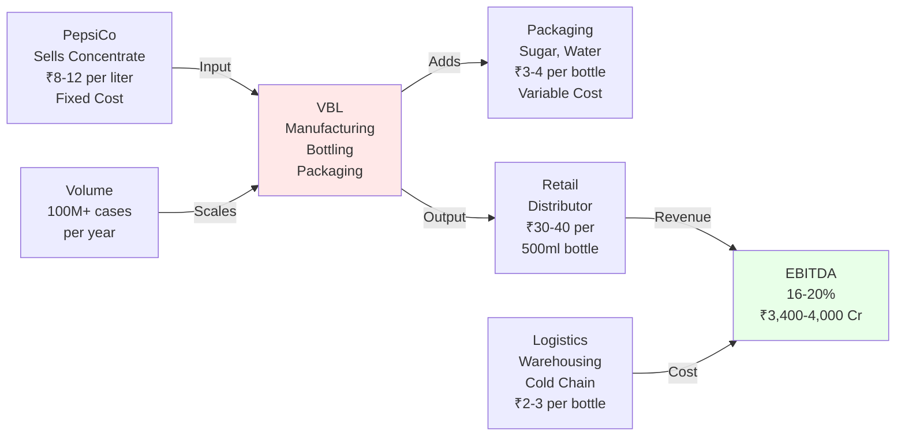

# BUSINESS UNDERSTANDING

**Read Time:** 8 minutes  
**Key Takeaway:** VBL's moat is distribution, not brands. That's both strength and constraint.  
**Who Should Read This:** Founders understanding capital-intensive models, investors assessing business durability

---

## The Insight

VBL is a **distribution and manufacturing business masquerading as a beverage company.**

It doesn't own Pepsi, Mountain Dew, Aquafina, or Sting. PepsiCo owns those brands. VBL manufactures and sells them. This distinction matters more than most investors realize.

**What VBL controls:**
- 56 bottling plants across India
- 2,400+ distribution trucks
- 500,000+ retail outlets (the widest network in Indian beverages)
- Manufacturing efficiency (cost control)
- Territory rights (exclusive PepsiCo bottler in assigned regions)

**What VBL doesn't control:**
- Brand pricing (PepsiCo decides if Pepsi costs ₹40 or ₹50)
- Brand innovation (Pepsi's R&D, Tropicana's reformulations)
- Brand marketing (celebrity endorsements, campaigns)
- Long-term contract terms (PepsiCo can renegotiate)

This asymmetry—owning distribution but not brands—creates both VBL's moat and its ceiling.

---

## Why This Matters

If you buy VBL, you're betting on **operational excellence and scale, not brand pricing power.**

A brand-owning company (like Nestlé or ITC) can raise prices whenever it wants. Consumers accept it because they love the brand. VBL can't do that. PepsiCo controls pricing. VBL can only control costs.

This means VBL's profit growth depends on three things:

1. **Volume growth** (sell more bottles)
2. **Product mix shift** (sell more high-margin products like Sting vs. low-margin Mirinda)
3. **Cost efficiency** (make each bottle more profitably through scale and automation)

Pricing power—the privilege of brand owners—is off the table.

---

## How the Economics Work

**Reading this flow:**

- **Input costs** (concentrate, packaging, sugar, aluminum) are semi-variable—they change with commodity cycles but not directly with VBL's decisions
- **Manufacturing cost** (labor, energy, depreciation) is mostly fixed—spreads across volume
- **Distribution cost** (trucks, warehousing, cold chain) is the operational complexity—must reach 500K outlets efficiently
- **Retail price** is set by PepsiCo—VBL has zero say
- **Margin** is the gap between retail price and all-in cost per bottle

When volume grows, margin per bottle improves (fixed costs spread). When commodity costs spike, margin per bottle falls. This is a **leverage game, not a pricing game.**

---

## Revenue Drivers (What Grows Revenue?)

**1. Volume Growth (60% of revenue growth)**

More bottles sold = more revenue. Simple. The drivers:

- **Heat/seasonality** (Q1 summer demand is 2x Q3 winter)
- **Geographic penetration** (rural expansion, new towns)
- **Income growth** (disposable income rising → more impulse consumption)
- **Youth demographic** (60% of India under 30, beverage consumption culture)

Historical: 24.6% revenue CAGR over 5 years. Now normalizing to 10–13% because base is large (₹21,685 Cr is substantial) and India market is maturing (urban areas saturating).

**2. Product Mix Shift (25% of revenue growth opportunity)**

Not all bottles are created equal. Margin per bottle varies:

| Product | Revenue Mix | Margin | Growth Driver |
|---|---|---|---|
| **CSD (Pepsi, 7UP)** | 75% | 14–15% | Slow (Campa pressure) |
| **Water (Aquafina)** | 21% | 18–19% | Steady (health trend) |
| **Sting (Energy)** | 2% currently | 22–25% | Fast (premiumization) |
| **Tropicana (Juice)** | 2% currently | 16–17% | Medium (health conscious) |

If Sting grows from 2% to 8% of revenue mix, blended EBITDA margins expand from 16–18% to 18–20% without any volume growth. This is THE opportunity.

**3. Geographic Expansion (15% of revenue growth opportunity)**

- **India:** 72% of revenue, maturing (urban saturation), Campa pressure
- **Africa:** 22–28% of revenue (post-acquisition 2023–24), unproven, high capex

Africa is the bet. If South Africa, Zambia, Zimbabwe plants scale, incremental revenue is ₹3,000–5,000 Cr over 3 years. If they disappoint, it's a capital allocation miss.

---

## Margin Drivers (What Moves Profitability?)

**Structural:** 16–20% EBITDA margins are sustainable given:
- Commodity cost volatility (sugar, aluminum, PET)
- Distribution cost efficiency (scale improves)
- Seasonality (Q1 13%+ margins, Q3 6–7% margins)

**Key drivers of margin expansion:**
- **Scale leverage** (fixed costs spread across more volume)
- **Product mix** (Sting + Aquafina have higher margins than Pepsi/7UP)
- **Operational efficiency** (automation, supply chain optimization)
- **Commodity normalization** (if sugar/aluminum prices ease)

**Key drivers of margin compression:**
- **Price wars** (Campa forcing promotional spend)
- **Commodity inflation** (sugar, aluminum, glass rising)
- **Capacity underutilization** (if growth disappoints, fixed costs don't spread)
- **Currency headwind** (Africa operations exposed to forex)

---

## The Moat: Distribution, Not Brands

**Why distribution is hard to replicate:**

- **500K+ retail outlets:** Took 30+ years to build. Competitors can't scale this in 3–5 years.
- **56 bottling plants:** Capital intensive (₹200–300 Cr per plant). Territory rights are exclusive.
- **Cold chain network:** Temperature-controlled logistics. Hard to copy. Advantage for packaged water and iced beverages.
- **Logistics efficiency:** Moving 100M+ cases annually. Route optimization, warehouse density. Operational edge.

**Why the moat is narrowing:**

- **Campa has Reliance backing:** Deep pockets for distribution investment. Already 100K+ outlets in 9 months.
- **Direct-to-consumer e-commerce:** Bypasses VBL's retail network. Amazon/Flipkart sell beverages.
- **PepsiCo contract risk:** If PepsiCo renegotiates terms, moat becomes less valuable. Unlikely but possible.

**Verdict:** Moat is **strong operationally but not fortress-like strategically.** It's defensible for 5–7 years if execution is excellent. Beyond that, erosion risk is real.

---

## Capital Requirements 
VBL's business requires heavy reinvestment:

- **New bottling plants:** ₹200–300 Cr each (capex for growth)
- **Distribution expansion:** New trucks, warehouses (capex for reach)
- **Africa operations:** South Africa plant, Zambia plant, etc. (capex for geography)
- **Working capital:** Inventory + receivables scale with revenue (cash tied up)

---

## Strategic Question

**If Sting doesn't scale to 8%+ of revenue mix, can VBL sustain margin expansion? Or is margin compression the new normal as Campa and others commoditize the CSD segment?**

This is the inflection point. Margins at 16–18% today suggest Sting IS scaling. If it plateaus at 2–3%, margins compress to 14–15% and stay there. That changes fair value downward by ₹50–100.
